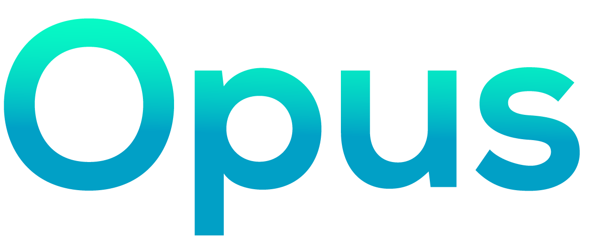

# Introduction
_Your DeFi liquidity powerhouse built on Neon EVM_

_**Opus**_ is taken from the word **[magnum opus](https://www.merriam-webster.com/dictionary/magnum%20opus)**, which means "great work", or you can say, _a masterpiece_. We are here to build and deliver you great things. 

## Welcome to Opus Finance

Welcome to Opus Finance (hereinafter referred to as Opus), your all-in-one quintessential Decentralized Finance suite built on top of Neon EVM — blockchain that combines the best of Ethereum and Solana. Utilizing these both chains will provide you the best of both worlds. Solana allows you to make transactions with low gas fees and high performances, mixed with the rich developer toolings from Ethereum ecosystem. 

> This is **your home** on Neon. Your liquidity voyages start with Opus, and we will provide you the upmost experience in using DeFi protocols.

## All-in-one DeFi suite
